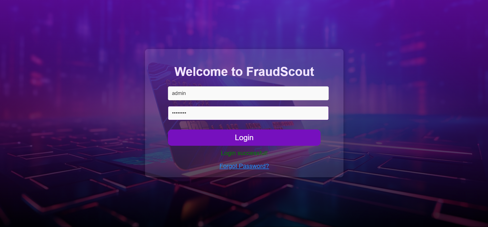
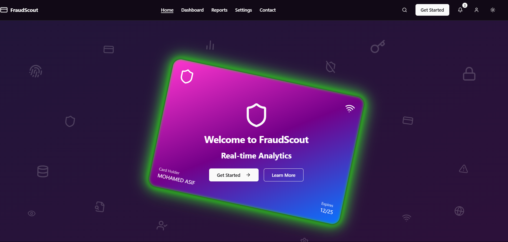
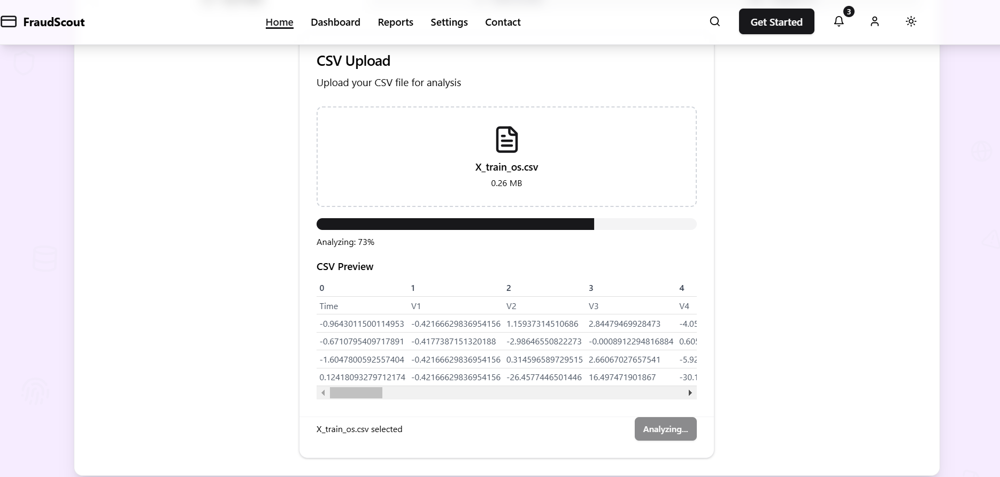
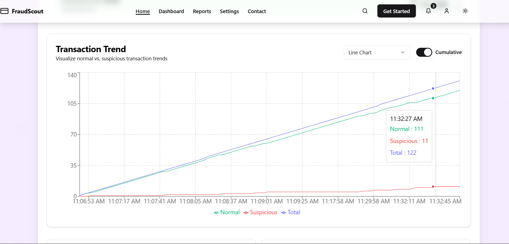
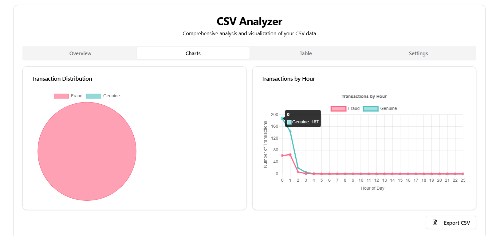
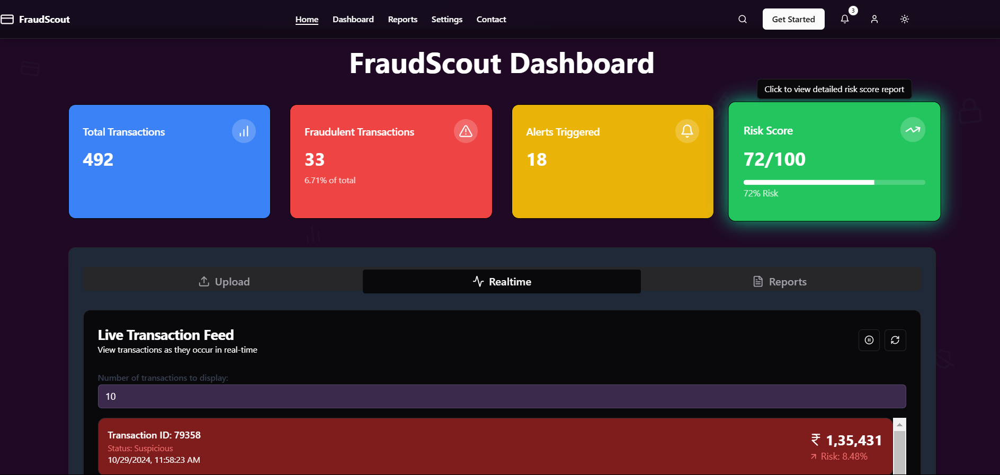

# 🕵️‍♂️ Anomaly Detection in Financial Transactions

<p align="center">
  
</p>

<p align="center">
  <a href="#-project-overview">Overview</a> •
  <a href="#-key-features">Features</a> •
  <a href="#%EF%B8%8F-technology-stack">Tech Stack</a> •
  <a href="#-getting-started">Getting Started</a> •
  <a href="#-how-it-works">How It Works</a> •
  <a href="#-contributing">Contributing</a> •
  <a href="#-license">License</a>
</p>

---

## 📊 Project Overview

FraudScout is an advanced fraud detection system designed to identify and prevent anomalies in financial transactions. This project leverages cutting-edge technologies and machine learning algorithms to provide real-time monitoring, analysis, and reporting of potentially fraudulent activities.

## 🚀 Key Features

- Real-time Transaction Monitoring: Watch transactions as they occur and get instant alerts on suspicious activities.
- Advanced AI-powered Detection: Utilize Random Forest algorithm for accurate fraud detection.
- Interactive Dashboard: Visualize transaction data, trends, and risk assessments through dynamic charts and graphs.
- CSV Data Analysis: Upload and analyze CSV files containing transaction data for comprehensive fraud detection.
- Customizable Rules: Set up and fine-tune detection rules to fit your specific needs.
- Risk Scoring: Assess the risk level of each transaction based on multiple factors.
- Responsive Design: Fully responsive web interface for seamless use across devices.

## 🛠️ Technology Stack

### Frontend
- React.js with Next.js
- UI Components: shadcn/ui
- Animations: Framer Motion
- Charts: Recharts
- CSV Parsing: Papa Parse
- Icons: Lucide React

### Backend
- Python
- Flask
- Scikit-learn (Random Forest algorithm)
- Pandas for data manipulation

## 🏗️ Project Structure

```
fraudscout/
├── frontend/
│   ├── components/
│   ├── pages/
│   ├── public/
│   ├── styles/
│   ├── lib/
│   └── app/
└── backend/
    ├── app.py
    └── model.pkl
```

## 🚦 Getting Started

### Frontend Setup

1. Clone the repository:
   ```
   git clone https://github.com/asif-mp3/financial-fraud-detection.git
   ```

2. Navigate to the frontend directory and install dependencies:
   ```
   cd fraudscout/frontend
   npm install
   ```

3. Run the development server:
   ```
   npm run dev
   ```

4. Open [http://localhost:3000](http://localhost:3000) in your browser.

### Backend Setup

1. Navigate to the backend directory:
   ```
   cd fraudscout/backend
   ```

2. Create and activate a virtual environment:
   ```
   python -m venv venv
   source venv/bin/activate  # On Windows, use `venv\Scripts\activate`
   ```

3. Install required packages:
   ```
   pip install -r requirements.txt
   ```

4. Run the Flask application:
   ```
   python app.py
   ```

## 🔍 How It Works

1. **Data Ingestion**: The system accepts CSV files containing transaction data through the frontend interface.
2. **Data Preprocessing**: The backend uses Pandas to preprocess the data, ensuring it matches the required format for the machine learning model.
3. **Feature Scaling**: The StandardScaler is applied to normalize the input features, improving the model's performance.
4. **Prediction**: The Random Forest model analyzes the preprocessed data to identify potential fraudulent transactions.
5. **Results**: Predictions are sent back to the frontend, where they are displayed in an interactive dashboard with various visualizations.

## 📊 Implementation

Here are some screenshots of the FraudScout implementation:

<p align="center">
  
  
</p>
<p align="center">
  
  
</p>
<p align="center">
  
  
</p>

  

## 🤝 Contributing

We welcome contributions to the FraudScout project. Please read our [CONTRIBUTING.md](CONTRIBUTING.md) file for details on our code of conduct and the process for submitting pull requests.

## 📄 License

This project is licensed under the MIT License - see the [LICENSE.md](LICENSE.md) file for details.

---

<p align="center">
  For more information, please contact the project maintainers or visit our website at <a href="https://www.fraudscout.com">www.fraudscout.com</a>.
</p>
